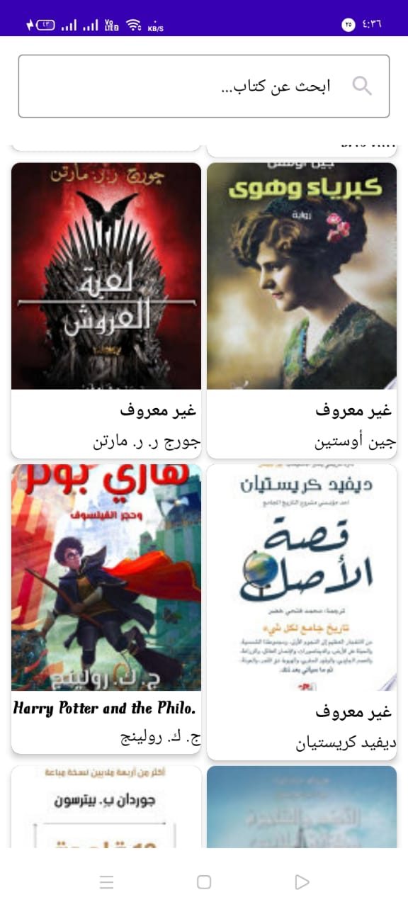
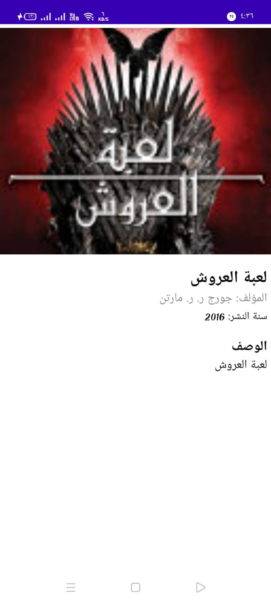

# Task-Books-For-Orange
Orange_Android_Development_Task 

The code is written in Kotlin, with the UI designed using Jetpack Compose and navigation handled by the Navigation Component. The Retrofit library is used to fetch data from the API, while Coroutines manage background server communication. Flow is utilized for data streams, and the architecture follows the MVVM pattern with Clean Code principles and modularization.

<body>
    <h1> Screen Android </h1>
      
         
</body>
